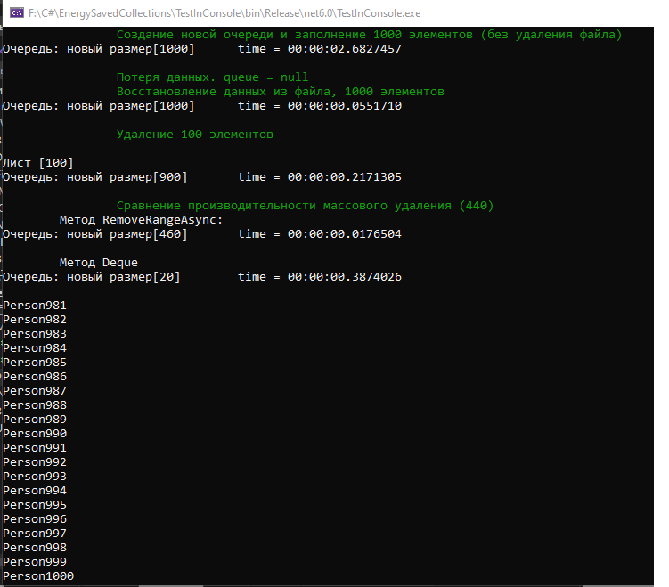

# NonVolatileCollections (Энергонезависимые коллекции)

Сериализация для сохраннения данных описывается путем реализации интерфейса.
Всего 3 проекта: 2 проекта тестовых (консоль и unit), одна Dll c коллекцией.
NonVolatileQueue.cs - файл реализации энергонезависимой очереди на базе стандартной очереди

Добавлена очередь, хранящая параллельно данные в файле базы SQLite.
- добавление элемента в очередь - добавляет его сперва в файл;
- удаление эелемента - сперва удаляет его из файла;
- методы изменения файла асинхронные;
- очередь реализует интерфейс IDisposable, чтобы автоматически удалять файл при завершении работы с коллекцией (поддерживает using(){});
- пример: using (var people = new NonVolatileQueue<Person>(new QueueDBSerializeHandler<Person>("people"))){}
- без using файл не удалится и к нему можно подключиться вновь. Реализована множественная загрузка из файла при инициализации;
- конструктор требует обработчик сериализации(реализующий интерфейс IQueueSerializeHandler);
  
  -- в качестве параметра принимает имя файла, крайне рекомендуется использовать имя переменной (какое-нибудь говорящее название), расширения указывать не нужно;
  -- файлы коллекций размещаются в атоматически создаваемой папке (Collections);
  
- есть возможность включения логирования (второй параметр конструктора сериализатора), логи будут вестись в папке Logs;
- специальный метод множественного удаления RemoveRangeAsync(int). сначала удаление происходит в базе.
  

